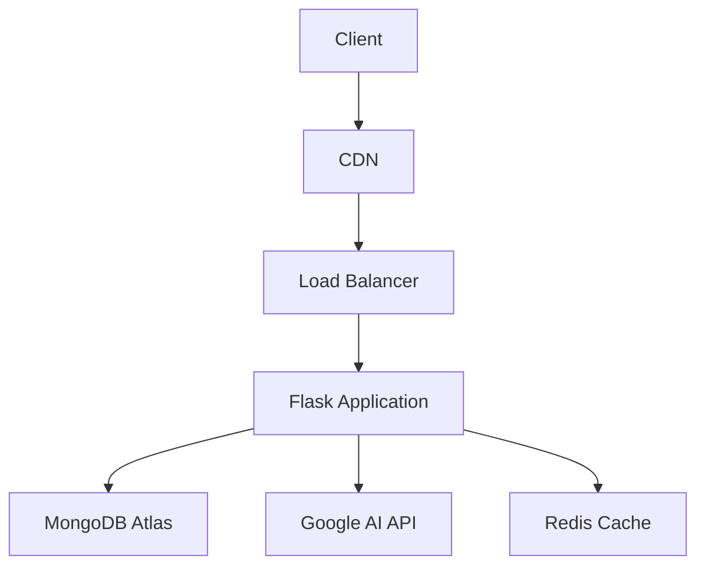

# 💸 FinTrack: AI-Powered Financial Intelligence Platform

[](https://python.org)
[](https://opensource.org/licenses/MIT)
[](https://render.com)

**Take Command of Your Financial Future**  
Transform raw spending data into actionable intelligence with our AI-enhanced expense management ecosystem.


## 🌟 Key Features

### 📊 Financial Intelligence Core
- **AI-Powered Expense Analysis** - Deep pattern recognition across spending categories
- **Predictive Cash Flow Modeling** - 30/60/90-day financial forecasts
- **Smart Expense Categorization** - Machine-learning powered classification

### 🔒 Security & Compliance
- Military-grade encryption for financial data
- OAuth2-compliant authentication flow
- Role-based access control (RBAC)

### 📈 Advanced Analytics
- Interactive financial health dashboard
- Customizable reporting engine (PDF/CSV)
- Real-time spending alerts & notifications

### 💡 AI Financial Assistant
- Natural language financial Q&A
- Personalized wealth-building strategies
- Regulatory-compliant investment insights

## 🚀 Getting Started

### Prerequisites
- Python 3.9+
- MongoDB Atlas cluster
- Google Gemini API key

### Installation
```bash
# Clone repository
git clone https://github.com/TechWithAkash/Expense_tracker.git
cd Expense_tracker

# Create virtual environment
python -m venv venv
source venv/bin/activate  # Linux/Mac
# venv\Scripts\activate  # Windows

# Install dependencies
pip install -r requirements.txt
```

### Configuration
Create `.env` file:
```ini
# MongoDB Configuration
MONGODB_URI=mongodb+srv://<user>:<password>@cluster.mongodb.net/finvision?retryWrites=true&w=majority
SECRET_KEY=your_flask_secret_key

# AI Services
GOOGLE_API_KEY=your_gemini_api_key

# Application Settings
DEBUG=False
SESSION_COOKIE_SECURE=True
```

### Launch Application
```bash
gunicorn --bind 0.0.0.0:5000 app:app
```

## 🛠 Tech Stack

### Core Platform
| Component              | Technology               |
|------------------------|--------------------------|
| **Backend Framework**  | Flask 2.0                |
| **Database**           | MongoDB Atlas            |
| **AI Engine**          | Google Gemini Pro        |
| **Auth**               | Flask-Login + JWT        |

### Operational Excellence
- Rate Limiting: `flask-limiter`
- Environment Management: `python-dotenv`
- WSGI Server: `gunicorn`

## 📚 API Reference

### AI Financial Advisor Endpoint
```http
POST /api/v1/financial-insights
Content-Type: application/json
Authorization: Bearer <token>

{
  "query": "Show spending trends for last quarter",
  "timeframe": "Q3-2023"
}
```

**Rate Limited**: 15 requests/minute

## 🌍 Deployment Architecture



## 🤝 Contributing

1. Fork the repository
2. Create feature branch (`git checkout -b feature/amazing-feature`)
3. Commit changes (`git commit -m 'Add amazing feature'`)
4. Push to branch (`git push origin feature/amazing-feature`)
5. Open Pull Request

## 📜 License
Distributed under MIT License. See `LICENSE` for details.

## ✉ Contact
Project Maintainer - [Your Name](mailto:vishwakarmaakashav17@gmail.com)

---

**Empowering Financial Literacy Through AI Innovation**  
*© 2023 FinTrack - Transforming Financial Data into Strategic Advantage*
